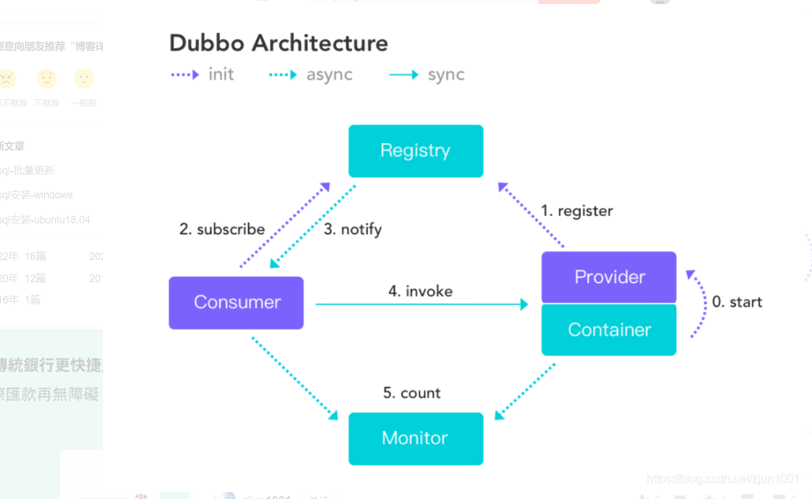

# springboot整合dubbo

## 1.什么是rpc

要知道什么是rpc，就要了解rpc产生的背景，这就涉及到进程通信问题。

在单体时代，系统所有功能都集中一起，本地方法直接调用接口，简单方便。而在微服务时代，原本单独系统被分割为多份，一个系统中的方法不可能直接被另外一个系统调用。为解决这个问题，就引入所谓的远程调用，像socket、tcp/udp、http等都属于远程调用。

tcp和http底层也是基于socket实现，再调用时候，需要做很多工作，像tcp的报文设置、黏包处理，http的请求头设置、返回解析等。虽然能实现远程调用，但使用起来肯定没有本地方法调用那么简单。那有没有这种技术，能把远程调用简单到像本地调用一样呢？有，这就是rpc（远程过程调用）。

rpc强调面向过程调用，把远程调用的很多底层细节都给你做好，整个调用过程对你是透明的。你只需像调用本地方法一样简单。

## 2.rpc调用过程

以server、client举例。server提供接口方法，client负责调用。过程如下：

**client：**

client -> 本地调用 -> 方法名、参数类型、参数值打包序列化 -> 网络传输 -> server ->

**server：**

server -> 接收数据 -> 反序列化 -> 拿到方法名，参数等 -> 本地方法调用 -> 将结果和类型序列化 -> 网络传输 -> client ->

**client：**

client -> 拿到结果 -> 反序列化 -> 得到数据

## 3.什么是dubbo

从rpc调用过程可知，其中涉及到序列化和反序列化、网络传输、调用策略（负载均衡、熔断等）等。此外，一个完善的rpc框架，还会有服务治理等功能。而这些，都有业内大牛已经给你做好了，直接使用即可。（当然，能力强，自己实现也行）。目前，比较知名的rpc框架有，Dubbo、Motan、Tars、Thrift、gRPC。对，没错，dubbo就是一个rpc框架，这就是dubbo。

## 4.dubbo原理

整个dubbo调用过程，可以概括为：

1. 当服务生产者启动后，会将服务信息（ip、port、接口）等信息注册到注册中心上。

2. 服务消费者启动后，会监听注册中心，拿到服务生产者的列表，缓存在本地。

3. 后续生产者如果下线，会立刻通知消费者。消费者重新拉取生产者列表。

4. 消费者轮询或随机从本地缓存列表中拿出一个，进行接口调用。

5. 生产者和消费者将调用数据发送监控中心，做监控使用。

## 5.springboot集成dubbo

详见代码

核心：

1. provider启动后，会把服务注册到zookeeper（配置在application.yml中），扫描包为所需接口的实现
2. 接口模块只负责提供公共接口
3. consumer启动后，也会向注册中心注册自身信息，他们通过注册中心完成服务的注册和调用